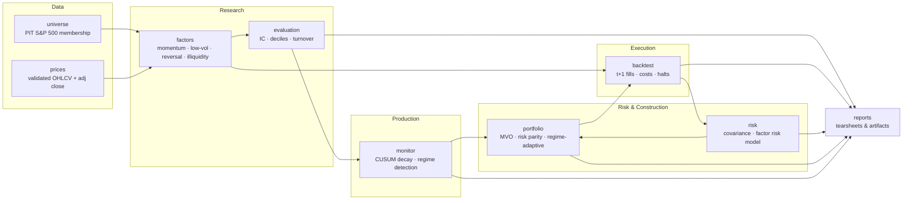

# quant-factor-lab

[](https://github.com/qiuuuu999/quant-factor-lab/actions/workflows/ci.yml)

**A survivorship-bias-free, point-in-time equity factor research platform —
from raw price data through backtested, risk-managed, regime-adaptive
portfolios, with production-style factor health monitoring — built to
surface every source of look-ahead bias rather than hide it.**

Every stage is independently testable and every backtest states honestly
where it wins and where it loses; see [Known Limitations](#known-limitations)
and [Experiment Results](#experiment-results) for results that were **not**
massaged to look better than they are.

## Architecture



| Stage | Package | Responsibility | Docs |
|-------|---------|-----------------|------|
| Data | `quantlab.data` | Point-in-time universe + validated price store — the survivorship-bias-free foundation. | — |
| Factors | `quantlab.factors` | Factor library + IC/quantile evaluation harness. | [`docs/factors.md`](docs/factors.md) |
| Backtest | `quantlab.backtest` | Event-driven engine: t+1 fills, real costs, halted-order handling. | [`docs/execution_timing.md`](docs/execution_timing.md) |
| Risk | `quantlab.risk` | Covariance estimators + style-factor risk decomposition. | [`docs/risk.md`](docs/risk.md) |
| Portfolio | `quantlab.portfolio` | Mean-variance / risk-parity / regime-adaptive construction, turnover control. | [`docs/portfolio.md`](docs/portfolio.md), [`docs/regime_adaptive.md`](docs/regime_adaptive.md) |
| Monitor | `quantlab.monitor` | CUSUM factor-decay detection + market-regime fit. | [`docs/monitoring.md`](docs/monitoring.md) |
| Reports | `quantlab.reports` | Headless matplotlib tearsheets + Markdown summaries for every experiment. | — |

## Core design decisions

Each of these exists because the naive approach silently leaks future
information into a backtest. The platform's test suite enforces every one of
them directly, not just by convention.

| Decision | Problem it solves | Where enforced |
|---|---|---|
| **Point-in-time universe reconstruction** (`quantlab.data.universe`) | Using *today's* S&P 500 membership for *past* dates deletes delisted (often loss-making) names from history, inflating backtested returns — the classic survivorship-bias trap. | `get_universe(as_of_date)` walks Wikipedia's change log backwards from the current snapshot; `tests/test_universe.py` checks reconstruction against hand-built change logs. |
| **t+1 execution (decide on close, fill on next open)** (`quantlab.backtest.engine`) | Filling a signal at the *same* close it was computed from lets the order co-determine the price it trades at — a subtle look-ahead that inflates every "close-to-close" backtest. | `execution_lag=1` + a separate `execution_prices` (adjusted open) panel; `docs/execution_timing.md` quantifies the before/after impact on the momentum strategy. |
| **Ledoit-Wolf shrinkage covariance** (`quantlab.risk.covariance`) | A sample covariance is singular whenever assets outnumber observations (the normal case: a few hundred names, a few years of monthly history) and can't be inverted by an optimizer or risk model. | `LedoitWolfCovariance` shrinks toward a full-rank target with a closed-form intensity (Ledoit & Wolf, 2004); `tests/test_risk.py` proves it stays invertible exactly where the sample estimator fails. |
| **Explicit look-ahead-guard tests** (every module) | A backtest can *look* correct and still leak information — the only way to be sure is to prove that mutating future data doesn't change past decisions. | `Factor.compute` raises `LookaheadBiasError` on any future-dated row; `quantlab.monitor`/`quantlab.portfolio.regime_adaptive` are checked by tests that corrupt data after a decision date and assert the decision is unchanged (`tests/test_regime_adaptive.py::test_regime_conditioned_weights_ignore_future_ic_observations` etc.). |

## Experiment results

Every experiment is reproducible with one script (`python scripts/<name>.py`)
and writes its own artifacts under `reports/<name>/` — figures, a Markdown
summary, and (where relevant) a CSV. Numbers below are the actual headline
metrics from the last run.

### 1. 12-1 Momentum vs. SPY, 2015-2025 — `scripts/run_momentum_backtest.py`

Point-in-time S&P 500, top 20% by 12-1 momentum, equal-weight, monthly,
t+1-open fills with realistic costs.

| Metric | Momentum 12-1 | SPY |
|---|---|---|
| CAGR | 10.16% | 13.46% |
| Sharpe | 0.59 | — |
| Max Drawdown | -37.73% | — |
| Information Ratio | -0.32 | — |

→ [`reports/momentum_12_1/`](reports/momentum_12_1/) · methodology: [`docs/execution_timing.md`](docs/execution_timing.md)

### 2. Factor library evaluation, 2015-2025 — `scripts/run_factor_evaluation.py`

IC / ICIR / decile spread for all four price factors. **Honest finding**:
across large-cap US 2015-2025 these classic factors were weak-to-negative
(insignificant ICs, negative decile spreads) — surfaced, not hidden.

| Factor | Mean IC | ICIR | Decile L/S (ann.) | Rank autocorr |
|---|---|---|---|---|
| 12-1 momentum | -0.0036 | -0.017 | -5.33% | +0.90 |
| Low volatility | -0.0047 | -0.019 | -9.32% | +0.99 |
| 1-month reversal | -0.0045 | -0.028 | -3.80% | +0.27 |
| Amihud illiquidity | -0.0109 | -0.082 | -7.03% | +0.95 |

→ [`reports/factor_eval/`](reports/factor_eval/) · methodology: [`docs/factors.md`](docs/factors.md)

### 3. Portfolio construction comparison, 2015-2025 — `scripts/run_portfolio_comparison.py`

Same 12-1 momentum selection, three ways to size it: equal weight,
mean-variance (Ledoit-Wolf covariance, turnover-penalized), risk parity.

| Metric | Equal Weight | Mean-Variance | Risk Parity |
|---|---|---|---|
| CAGR | 10.16% | 9.51% | 9.26% |
| Sharpe | 0.59 | 0.53 | 0.57 |
| Annual Volatility | 19.48% | 21.25% | 18.45% |
| Annual Turnover | 5.48x | 6.27x | 6.20x |

→ [`reports/portfolio_comparison/`](reports/portfolio_comparison/) · methodology: [`docs/portfolio.md`](docs/portfolio.md)

### 4. Factor risk attribution, 2025-12-31 snapshot — `scripts/run_risk_attribution.py`

4-factor cross-sectional risk model applied to the momentum strategy's
holdings: net factor exposure and factor-vs-specific variance split.

| Factor | Exposure (σ) |
|---|---|
| 12-1 momentum | +1.50 |
| Low volatility | -0.51 |
| 1-month reversal | +0.01 |
| Amihud illiquidity | -0.35 |

→ [`reports/risk_attribution/`](reports/risk_attribution/) · methodology: [`docs/risk.md`](docs/risk.md)

### 5. Factor health monitoring, 2015-2025 — `scripts/run_factor_monitoring.py`

CUSUM change-point test on each factor's rolling IC (95% confidence) +
SPY-regime-conditioned IC fit.

| Factor | Status | CUSUM stat / critical | Best regime | Worst regime |
|---|---|---|---|---|
| 12-1 momentum | OK | 0.48 / 1.36 | low_vol_up | high_vol_up |
| Low volatility | OK | 0.57 / 1.36 | low_vol_up | high_vol_down |
| 1-month reversal | OK | 1.35 / 1.36 (closest) | high_vol_down | low_vol_up |
| Amihud illiquidity | OK | 0.49 / 1.36 | high_vol_up | low_vol_up |

→ [`reports/monitor/`](reports/monitor/) · methodology: [`docs/monitoring.md`](docs/monitoring.md)

### 6. Regime-adaptive vs. static multi-factor vs. pure momentum vs. SPY, 2017-2025 — `scripts/run_regime_adaptive_backtest.py`

Dynamically re-weights the 4-factor composite by each factor's
point-in-time, regime-conditioned IC track record (2015-2016 held out as
warm-up). **Honest finding**: beats a naive static factor blend, but does
**not** beat the platform's simplest single-factor strategy on a
risk-adjusted basis, and all four constructed strategies trail SPY.

| Metric | Regime-Adaptive | Static Multi-Factor | Pure Momentum | SPY |
|---|---|---|---|---|
| CAGR | 11.92% | 6.12% | 11.40% | 14.97% |
| Sharpe | 0.58 | 0.40 | **0.63** | 0.85 |
| Max Drawdown | -49.30% | -42.52% | -37.73% | -33.72% |
| Annual Turnover | 14.02x | 10.36x | 5.45x | 0.00x |

→ [`reports/regime_adaptive/`](reports/regime_adaptive/) · methodology + full analysis: [`docs/regime_adaptive.md`](docs/regime_adaptive.md)

## Known limitations

Stated plainly rather than buried — each is measured or explained, not
hand-waved.

- **Residual survivorship bias from missing prices: ~16% (118/735 tickers, 2015-2025 union).**
  The point-in-time universe correctly *includes* every ticker that was ever
  in the index, but a free data source (yfinance) has no history for many
  delisted/acquired names. `download_prices` reports this as an explicit
  missing rate rather than silently dropping names; roughly 15/118 are
  already catalogued as known delistings in `configs/ticker_renames.yaml`,
  the remainder are largely uncatalogued M&A (`ACE`, `AGN`, `CELG`, `BRCM`,
  …) that a licensed dataset (e.g. CRSP) would close but a free one cannot.
- **Wikipedia change-log completeness.** The index-membership reconstruction
  depends on Wikipedia's "selected changes" table, which is *sparser* the
  further back it goes — reconstructed constituent counts drift by a
  handful of names before ~2012 (recent years are accurate). See
  `docs/factors.md` / `quantlab.data.universe` module docstring.
- **No point-in-time fundamentals — price-only factor library.** Value and
  quality factors need financials *as first reported*, tagged with actual
  filing-availability dates. Free sources only expose the latest, restated
  statements with no as-of dating, which would silently back-fill
  information that wasn't yet public. Rather than ship a factor whose
  headline number is a data artifact, the library stays price-only until a
  properly PIT-dated fundamentals source (Compustat PIT, S&P Capital IQ, or
  SEC EDGAR indexed by filing acceptance datetime) is available.
- **Single historical sample period.** Every backtest above covers 2015-2025
  (2017-2025 for the regime-adaptive comparison) — one draw of market
  history, heavily influenced by the 2010s low-rate regime and the
  post-2020 mega-cap concentration that caused every constructed strategy in
  this repo to trail SPY. None of the reported Sharpe/CAGR numbers should be
  read as a stable, regime-independent estimate; `docs/monitoring.md`
  further notes that a genuinely low-volatility bear-market regime
  (`low_vol_down`) is nearly absent even within this one sample.

## Getting started

### Local

```bash
python3 -m venv .venv
source .venv/bin/activate
pip install -e ".[dev]"

pytest              # 181 tests, hermetic — no network or data download required
ruff check .         # lint

python scripts/download_backtest_data.py   # one-time: ~700 tickers from yfinance
python scripts/run_momentum_backtest.py    # then any script under scripts/
```

### Docker

One command reproduces the entire pipeline — install, test, lint, download
data, and run every experiment script in order — writing all artifacts to
`./reports` and caching downloaded prices to `./data` on the host so re-runs
don't re-download ~700 tickers:

```bash
docker compose up --build
```

Equivalently without compose:

```bash
docker build -t quant-factor-lab .
docker run --rm -v "$(pwd)/data:/app/data" -v "$(pwd)/reports:/app/reports" quant-factor-lab
```

The full run downloads live data from yfinance and takes several minutes;
subsequent runs reuse the mounted `./data` cache.

## Continuous integration

Every push and pull request runs [`.github/workflows/ci.yml`](.github/workflows/ci.yml):
`ruff check .` and the full `pytest` suite (with coverage) across Python
3.10 and 3.12. The test suite is fully hermetic — synthetic data only, no
network access or local price cache required — so CI runs identically to a
fresh clone.

## Project structure

```
quant-factor-lab/
├── .github/workflows/    # CI (ruff + pytest, matrix over Python 3.10/3.12)
├── src/quantlab/         # the platform (one subpackage per pipeline stage)
│   ├── data/             # PIT universe & price store
│   ├── factors/          # factor library + IC/quantile evaluation
│   ├── backtest/         # event-driven engine (t+1 fills, costs, halts)
│   ├── risk/             # covariance estimators + factor risk model
│   ├── portfolio/        # MVO / risk parity / regime-adaptive construction
│   ├── monitor/          # CUSUM decay detection + regime classification
│   └── reports/          # headless matplotlib tearsheets & Markdown
├── scripts/               # one reproducible experiment per file
├── tests/                 # hermetic test suite (181 tests)
├── docs/                  # methodology per module (factors/risk/portfolio/monitor/…)
├── configs/                # backtest costs, ticker rename/delisting catalogue
├── notebooks/              # research notebooks
├── reports/                 # generated artifacts, one subdir per experiment
├── Dockerfile, docker-compose.yml, docker/reproduce.sh
└── pyproject.toml
```

## Tech stack

pandas · numpy · scipy · matplotlib · yfinance · pyarrow · pydantic ·
requests · beautifulsoup4 · pytest · pytest-cov · ruff

## License

MIT
